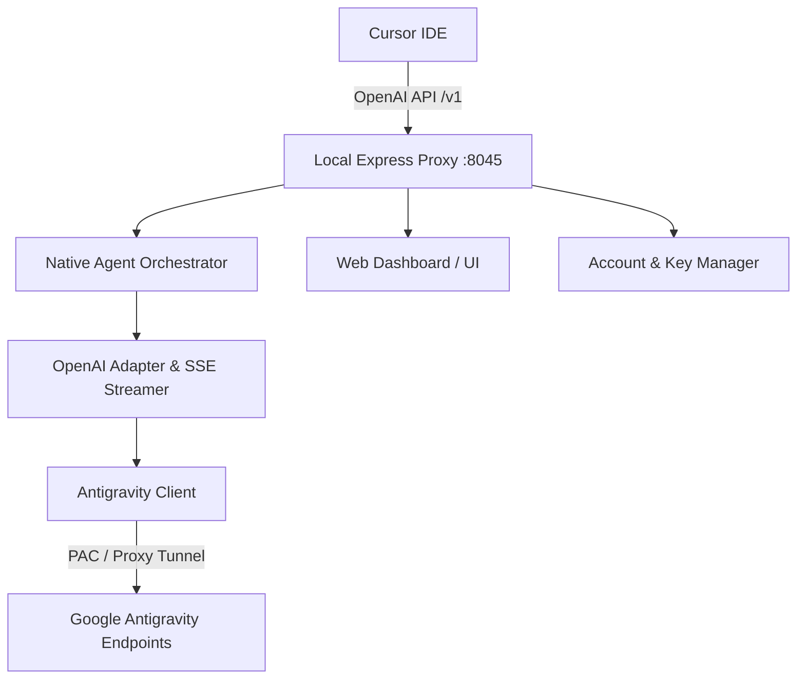

# Antigravity Cursor Bridge ⚡️

> Supercharge **Cursor IDE** with Google's state-of-the-art **Antigravity models** (Gemini 3.8 Flash High, Claude 4.6 Thinking, and more) through a high-performance, local OpenAI-compatible proxy and real-time management dashboard.

---

## 🚀 Overview

**Antigravity Cursor Bridge** unlocks the full capability of Antigravity's next-generation reasoning engines right inside Cursor. By running a lightweight, local Express-based proxy, Cursor can seamlessly route standard `/v1/chat/completions` and `/v1/models` requests to upstream Antigravity endpoints with full streaming (SSE), tool calling, and multimodal support.

---

## ✨ Features

- **🎯 Drop-in OpenAI Compatibility**: Emulates standard OpenAI API endpoints (`/v1/models`, `/v1/chat/completions`) with full Server-Sent Events (SSE) streaming.
- **🤖 Native Cursor Agent Integration (`nativeAgent.js`)**:
  - Full support for Cursor interaction modes: **Agent Mode**, **Plan Mode**, and **Ask Mode**.
  - Dual-mode tool invocation supporting both structured JSON function calling and Antigravity XML syntax.
  - Multi-turn conversation fingerprinting preserving Cascade agent session context.
  - Multimodal media handling (inline images, screenshots) and intelligent middle-out context truncation.
- **🧠 Frontier Model Fleet**:
  - `dominate-gemini-3.8-flash-high`
  - `gemini-3.8-flash-medium` / `gemini-3.8-flash-low`
  - `gemini-3.7-flash-high`
  - Extended-thinking Claude models with live reasoning token streams.
- **🔑 Multi-Account & Key Management (`accountManager.js`)**:
  - Rotate multiple Antigravity credentials to balance rate limits and quotas.
  - Generate virtual local API keys (`sk-antigravity-...`).
- **🚇 Remote Access Tunneling (`tunnelManager.js`)**:
  - Instant SSH-based tunneling (Serveo) to expose your bridge for remote machines or paired development.
- **📊 Classical Premium Web Dashboard (`client/` & `dist/`)**:
  - Built-in React 19 web UI to inspect model quotas, monitor token limits, switch active accounts, and manage API keys.

---

## 🛠️ Architecture



---

## 📦 Getting Started

### 1. Prerequisites
- **Node.js**: v18.0.0 or higher
- **npm** / **pnpm** / **yarn**

### 2. Installation
Clone the repository and install dependencies:

```bash
git clone https://github.com/your-repo/antigravity-cursor-bridge.git
cd antigravity-cursor-bridge
npm install
```

### 3. Launching the Bridge

Start in development mode with automatic reload:
```bash
npm run dev
```

Or run in production mode:
```bash
npm start
```

By default, the server listens on **`http://localhost:8045`**.

---

## ⚙️ Cursor Configuration

Connect Cursor to your local bridge in just a few clicks:

1. Open **Cursor Settings** (`Cmd + ,` or `Ctrl + ,`).
2. Navigate to **Features** → **Models**.
3. Under **OpenAI API Key**, configure:
   - **Override OpenAI Base URL**: `http://localhost:8045/v1`
   - **API Key**: Enter any generated local key (e.g. `sk-antigravity-local` or your key from the dashboard).
4. Add your preferred model name(s) under **Model Names**:
   - `dominate-gemini-3.8-flash-high`
   - `gemini-3.8-flash-medium`
   - `gemini-3.7-flash-high`
5. Switch to Agent mode in Cursor chat and start building!

---

## 💻 Web Management Dashboard

Access the local control center at:
```
http://localhost:8045
```

From the dashboard, you can:
- View real-time request logs and latency metrics.
- Monitor token quotas across authenticated accounts.
- Configure SOCKS5/HTTP proxy settings.
- Enable or disable public SSH tunnels.

---

## 📂 Project Structure

```
├── client/                 # React 19 web dashboard source
│   ├── index.html
│   └── src/
├── dist/                   # Production distribution bundle
├── src/                    # Core bridge logic
│   ├── server.js           # Express app & route definitions
│   ├── nativeAgent.js      # Cursor mode orchestration & context management
│   ├── openaiAdapter.js    # Schema conversion & SSE stream transform
│   ├── antigravityClient.js# Upstream API client
│   ├── accountManager.js   # Multi-account auth & key rotation
│   └── tunnelManager.js    # Remote SSH tunneling service
├── package.json
└── README.md
```

---

## 📄 License

This project is licensed under the [MIT License](LICENSE).
