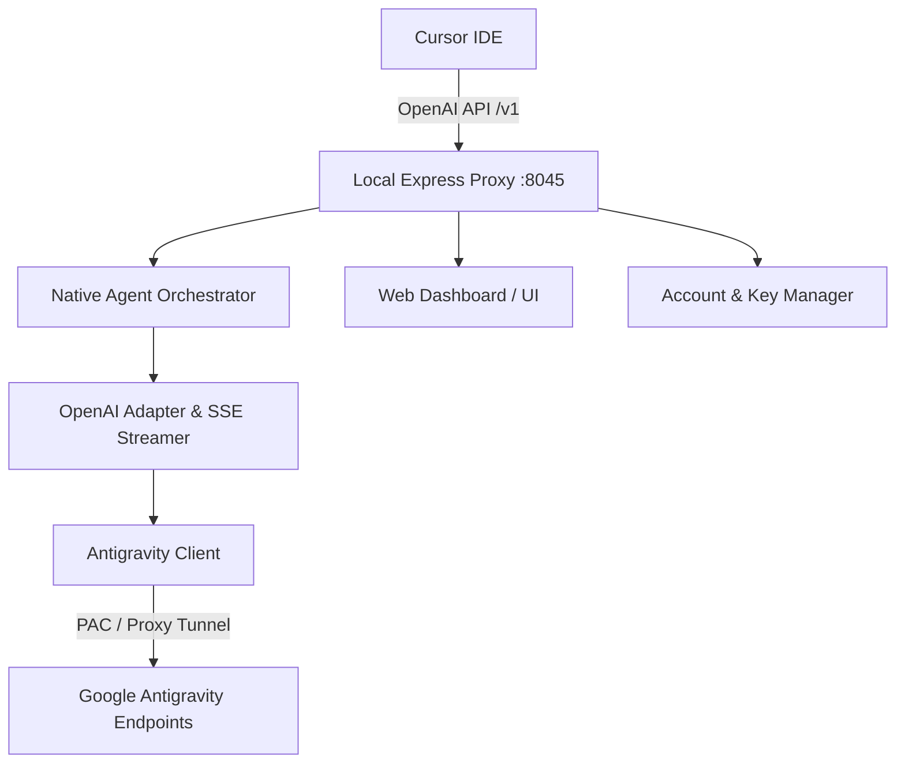

# Antigravity Cursor Bridge ⚡️

> Supercharge **Cursor IDE** with Google's state-of-the-art **Antigravity models** (Gemini 3.8 Flash High, Claude 4.6 Thinking, and more) through a high-performance, local OpenAI-compatible proxy and real-time management dashboard.

---

## 🚀 Overview

**Antigravity Cursor Bridge** unlocks the full capability of Antigravity's next-generation reasoning engines right inside Cursor. By running a lightweight, local Express-based proxy, Cursor can seamlessly route standard `/v1/chat/completions` and `/v1/models` requests to upstream Antigravity endpoints with full streaming (SSE), tool calling, and multimodal support.

---

## ✨ Features

- **🎯 Drop-in OpenAI Compatibility**: Emulates standard OpenAI API endpoints (`/v1/models`, `/v1/chat/completions`) with full Server-Sent Events (SSE) streaming.
- **🤖 Native Cursor Agent Integration (`nativeAgent.js`)**:
  - Full support for Cursor interaction modes: **Agent Mode**, **Plan Mode**, and **Ask Mode**.
  - Dual-mode tool invocation supporting both structured JSON function calling and Antigravity XML syntax.
  - Stateless multi-turn tool loops driven by Cursor's authoritative conversation state.
  - Multimodal media handling (inline images, screenshots) and intelligent middle-out context truncation.
  - Strict Cursor-orchestrated mode: Cursor reads/writes local files and runs commands; the VPS only reasons and returns OpenAI tool calls.
- **🧠 Frontier Model Fleet**:
  - `dominate-gemini-3.8-flash-high`
  - `gemini-3.8-flash-medium` / `gemini-3.8-flash-low`
  - `gemini-3.7-flash-high`
  - Extended-thinking Claude models with live reasoning token streams.
- **🔑 Multi-Account & Key Management (`accountManager.js`)**:
  - Rotate multiple Antigravity credentials to balance rate limits and quotas.
  - Generate virtual local API keys (`sk-antigravity-...`).
- **🚇 Optional Remote Access Tunneling (`tunnelManager.js`)**:
  - Opt-in SSH-based tunneling (Serveo) for Cursor installations that cannot reach localhost.
  - Refuses to expose the bridge until at least one generated API key exists.
- **📊 Classical Premium Web Dashboard (`client/` & `dist/`)**:
  - Built-in React 19 web UI to inspect model quotas, monitor token limits, switch active accounts, and manage API keys.

---

## 🛠️ Architecture



---

## 📦 Getting Started

### 1. Prerequisites
- **Node.js**: v18.0.0 or higher
- **npm** / **pnpm** / **yarn**

### 2. Installation
Clone the repository and install dependencies:

```bash
git clone https://github.com/your-repo/antigravity-cursor-bridge.git
cd antigravity-cursor-bridge
npm install
```

### 3. Launching the Bridge

Start in development mode with automatic reload:
```bash
npm run dev
```

Or run in production mode:
```bash
npm start
```

By default, the server listens on **`http://localhost:8045`**.

---

## ⚙️ Cursor Configuration

Connect Cursor to your local bridge in just a few clicks:

1. Open **Cursor Settings** (`Cmd + ,` or `Ctrl + ,`).
2. Navigate to **Models**.
3. In the dashboard's **API Keys** tab, generate a key. Then under **OpenAI API Key**, configure:
   - **Override OpenAI Base URL**: `http://localhost:8045/v1`
   - **API Key**: Enter the generated dashboard key.
4. Add your preferred model name(s) under **Model Names**:
   - `dominate-gemini-3.8-flash-high`
   - `gemini-3.8-flash-medium`
   - `gemini-3.7-flash-high`
5. Switch to Agent mode in Cursor chat and start building!

Cursor currently applies the OpenAI base URL override broadly rather than per custom model. Turn the override off when returning to Cursor-managed models. Custom API keys affect Chat/Agent; Cursor Tab completion continues to use Cursor's own models.

### Cursor as orchestrator, VPS as brain

This is the default architecture. Each request is stateless at the Antigravity Cascade layer, while Cursor sends the authoritative conversation and tool results on every turn. Local paths—including dragged log files—are explicitly marked as Cursor-local. If content is not embedded in the request, the model must return a Cursor-provided read/search tool call; it must never read the corresponding path on the VPS.

Do not enable `ANTIGRAVITY_SESSION_REUSE` for normal VPS use. It exists only for compatibility experiments and can reintroduce stale Antigravity-native agent state.

### Remote Cursor access

Cursor may send custom-model requests through its servers, which cannot reach your machine's `localhost`. If direct local configuration fails:

1. Create an API key in the dashboard and configure strong `DASHBOARD_USERNAME` / `DASHBOARD_PASSWORD` values.
2. Set `ENABLE_TUNNEL=true` and `DISABLE_TUNNEL=false` in `.env.local`.
3. Restart the bridge and use the displayed HTTPS `/v1` URL.

The public tunnel is disabled by default. Never expose the bridge without a generated API key and dashboard credentials.

---

## 💻 Web Management Dashboard

Access the local control center at:
```
http://localhost:8045
```

From the dashboard, you can:
- View real-time request logs and latency metrics.
- Monitor token quotas across authenticated accounts.
- Configure SOCKS5/HTTP proxy settings.
- Enable or disable public SSH tunnels.

---

## 📂 Project Structure

```
├── client/                 # React 19 web dashboard source
│   ├── index.html
│   └── src/
├── dist/                   # Production distribution bundle
├── src/                    # Core bridge logic
│   ├── server.js           # Express app & route definitions
│   ├── nativeAgent.js      # Cursor mode orchestration & context management
│   ├── openaiAdapter.js    # Schema conversion & SSE stream transform
│   ├── antigravityClient.js# Upstream API client
│   ├── accountManager.js   # Multi-account auth & key rotation
│   └── tunnelManager.js    # Remote SSH tunneling service
├── package.json
└── README.md
```

---

## 📄 License

This project is licensed under the [MIT License](LICENSE).
